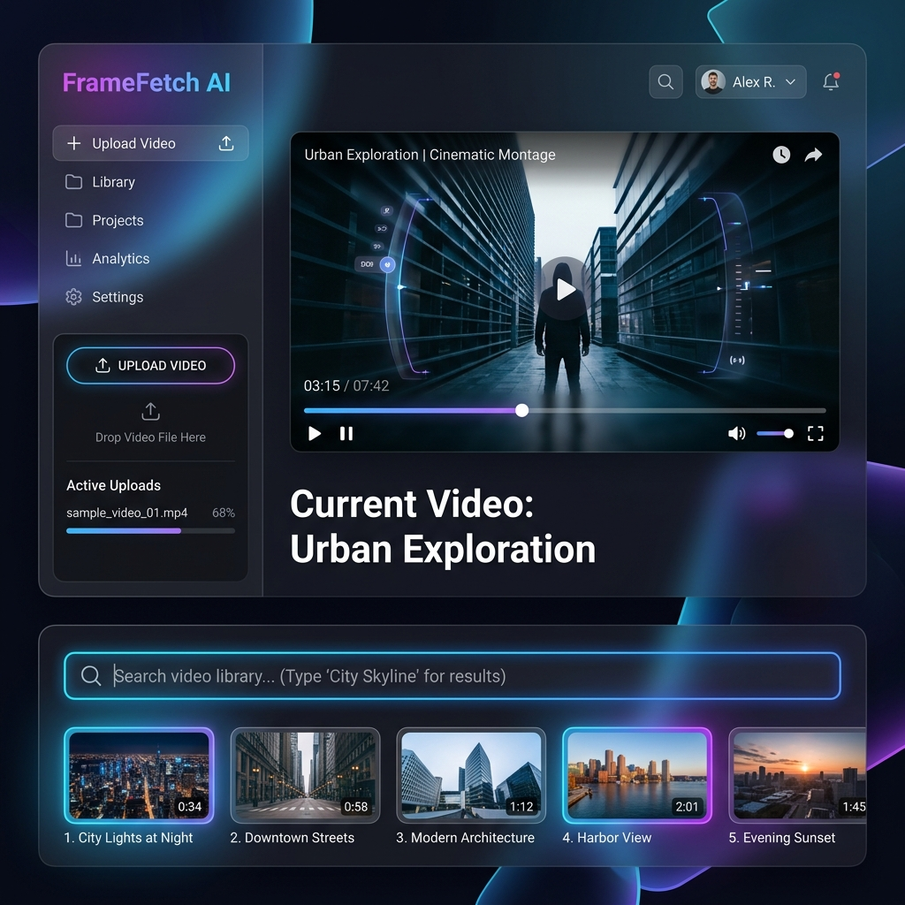

# 🎬 FrameFetch AI



**FrameFetch AI** is a state-of-the-art, modern application that allows users to instantly discover specific moments in any video using powerful **multi-modal semantic search**. With a sleek, dark-themed, glassmorphism UI built on Streamlit, FrameFetch completely rethinks the way you interact with video content by allowing natural language search queries across both **visual scenes** and **spoken speech**.

---

## ✨ Features

- **🧠 Multi-Modal Search:** Type anything like "crowded train station" or "red jacket" to instantly find visually matching frames. 
- **🎙️ Speech Understanding:** The system actively transcribes video speech and matches your query to spoken words.
- **📚 Video Library:** Automatically stores your previously uploaded videos in the session for seamless context switching.
- **⚡ Extremely Fast Processing:** Optimized to run performantly on CPU hardware using robust batching and efficient AI model variants.
- **🎨 Premium Interface:** Beautifully crafted clean mode UI featuring modern cards and no neon abstractions.
- **▶️ Instant Playback:** Click any search hit (visual or speech) to jump straight to that exact moment in the video.

## 🤖 Models & Architecture

FrameFetch AI leverages top-tier machine learning models to accomplish real-time inference:

*   **[CLIP (clip-ViT-B-32)](https://huggingface.co/sentence-transformers/clip-ViT-B-32):** Encodes every sampled frame and text query into a dense vector space to find semantic similarities between text and images.
*   **[Whisper (Base)](https://github.com/openai/whisper):** OpenAI's speech recognition model is used to extract high-accuracy transcripts from the video audio.
*   **[MiniLM (all-MiniLM-L6-v2)](https://huggingface.co/sentence-transformers/all-MiniLM-L6-v2):** Specifically utilized to encode the transcribed speech segments to enable incredibly fast semantic text-to-text matching.

## 🛠️ Tech Stack & Libraries

The backend and frontend are tightly integrated in Python, utilizing:
- **[Streamlit](https://streamlit.io/)**: For the highly-responsive, customized frontend interface.
- **[OpenCV](https://opencv.org/)**: For robust and rapid frame extraction from the video files.
- **[PyTorch](https://pytorch.org/)**: Serving as the core deep learning framework powering all inference.
- **[Sentence-Transformers](https://sbert.net/)**: Facilitating the text and image embeddings.

## 🚀 How to Run Locally

1. **Clone the repository:**
   ```bash
   git clone https://github.com/cyclotron1378/FrameFetch_AI.git
   cd FrameFetch_AI
   ```

2. **Install the dependencies:**
   It is recommended to use a virtual environment.
   ```bash
   pip install -r requirements.txt
   ```

3. **Run the Streamlit application:**
   ```bash
   streamlit run app.py
   ```

4. Upload your video, hit **Analyze**, and start searching!

---
*Built with ❤️ utilizing cutting-edge AI technology.*
